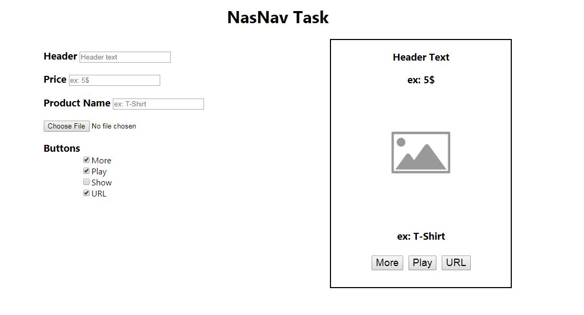

# NasNav Task

## Table of Contents
* [About the Project](#about-the-project)
* [Steps to run the Project](#steps-to-run-the-project)
  * [Prerequisites](#prerequisites)
  * [Installing The Project in ***Development Mode***](#installing-the-project-in-development-mode)
  * [Installing The Project in ***Production Mode***](#installing-the-project-in-production-mode)
  * [Live Demo](#live-demo)
* [Credits](#credits)
* [License](#license)

### About the Project
* This is a task from a software company to test my skills before hiring.
* Mission was to make user able to see his changes on the right side of the page which will be a phone shape.
* All done using React.

### Steps to Run The Project
#### Prerequisites
1. Install [Node](https://nodejs.org/en/).
2. npm is bundled with node.

#### Installing The Project in ***Development Mode***
1. Use `Node.js command prompt`.
2. Clone the repository with `git clone https://github.com/MalakJoseph/nasnav-task`.
3. Go to the app directory `cd nasnav-task`.
4. Run `npm install` to install scripts and dependencies of the project.
5. Lastly, run `npm start` to have the project running on `http://localhost:3000/`.
6. ***Enjoy***.

***NOTE:*** *The service workers for this app will only cache the site when it is in production mode.*

#### Installing The Project in ***Production Mode***
1. Run `npm run build` to create a build version of the app
2. Install serve by `npm install -g serve`
3. Use `serve -s build` to serve the app on [http://localhost:5000](http://localhost:5000).

#### Live Demo
You can visit it [here](https://malakjoseph.github.io/nasnav-task/)

### Credits
* [create-react-app](https://github.com/facebook/create-react-app)

### License
This project is licensed under the terms of the MIT license.
